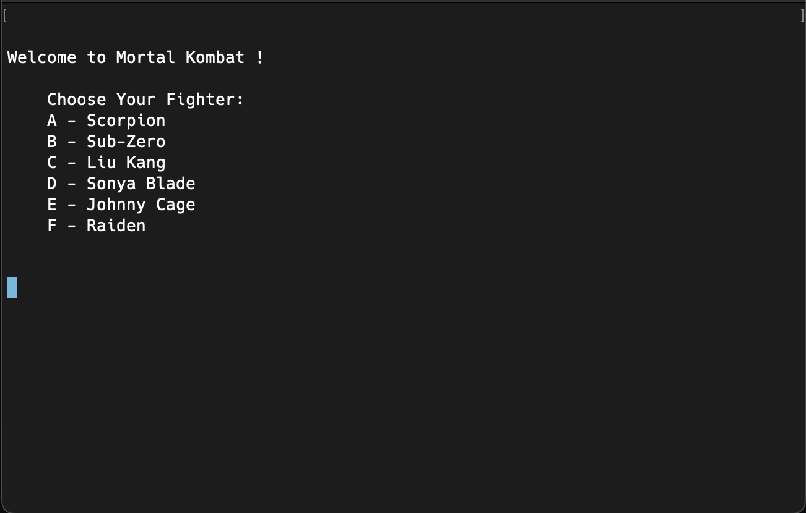
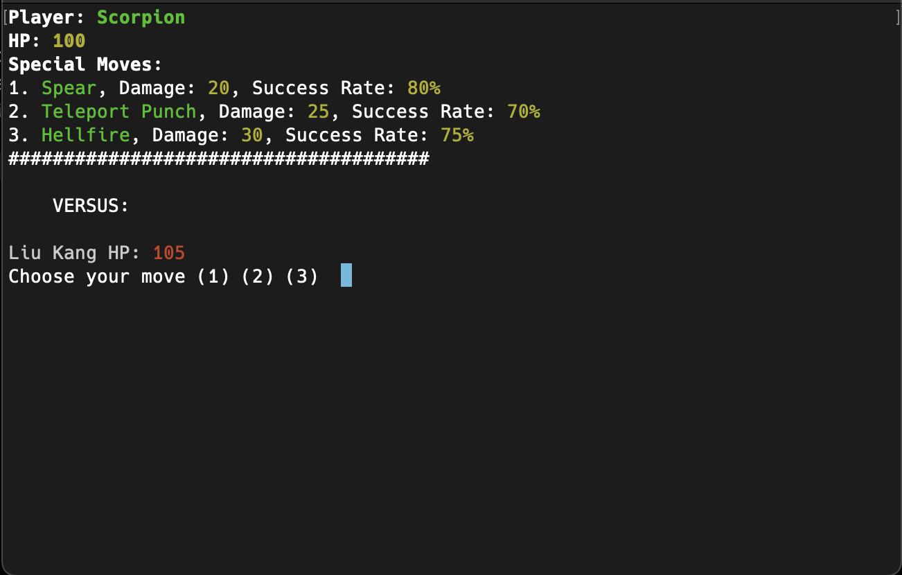
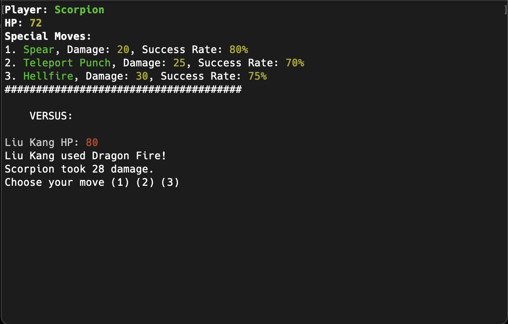

# Terminal Game: Mortal Kombat 

ℹ️ This game is still being worked on. If you find any bugs, issues, or would like to add any features open a pull request.

## Set Up
1. To start, clone the repository to your local environment and `cd` into it:  
```shell
> git clone https://github.com/<username>/terminal-game.git
> cd terminal-game
```
2. Install prompt-sync:  
```shell
> npm i prompt-sync
```

3. To initialize the game run:  
```shell
> node app.js
```

## How to Play
The game starts by asking the user to select a fighter by inputting a specific letter:  

  

Your opponent will be selected for you automatically. You are then shown your player stats along with your opponents fighter and hp level.  
  
You are also prompted to choose a move. Based on your special moves list within your player stats view select a move using the keys 1 - 3:  



Hp level will be adjusted accordingly for each player. The terminal will also display the move your opponent used and the damage it cause you. You can reference your opponents hp as well. Repeat this process until a player reachs 0 hp or below.  

  

The game will then display the winner of the game:  


